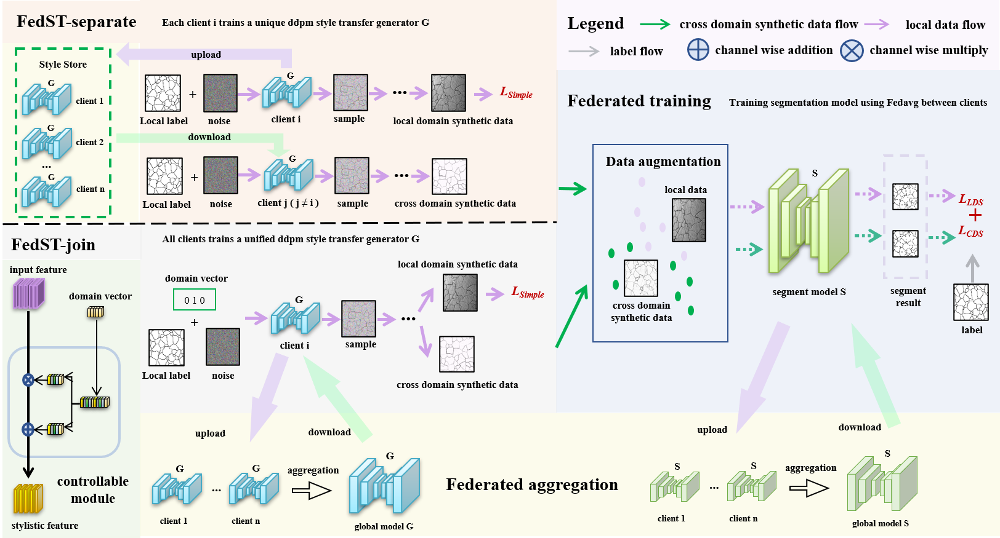

# FedST
A federated image segmentation method based on style transfer

Implementation of the paper accepted by AAAI 2024: [FedST: Federated Style Transfer Learning for Non-IID image segmentation]()

**Abstract:** Federated learning collaboratively trains machine learning models among different clients while keeping data privacy and has become the mainstream for breaking data silos. However, the non-independently and identically distribution (i.e., Non-IID) characteristic of different image domains among different clients reduces the benefits of federated learning and has become a bottleneck problem restricting the accuracy and generalization of federated models. In this work, we propose a novel federated image segmentation method based on style transfer, FedST, by using a denoising diffusion probabilistic model to achieve feature disentanglement and image synthesis of cross-domain image data between multiple clients. Thus it can share style features among clients while protecting structure features of image data, which effectively alleviates the influence of the Non-IID phenomenon. 



## Dependencies

- Python>=3.6
- Pytorch>=1.8.2

## Usage

- Prepare your dataset and place them under the `dataset` folder. The file structure is similar to the following shown

  ```
  Name of your dataset
  ├─test
  │  ├─real_image
  │  │  ├─0
  │  │  └─1
  │  └─real_label
  │      ├─0
  │      └─1
  └─train
      ├─fake_image
      │  ├─0
      │  └─1
      ├─real_image
      │  ├─0
      │  └─1
      └─real_label
          ├─0
          └─1
  ```

- Train style transfer generator to generate synthetic cross-domain data and place them under the `train/fake_image` folder as shown above.

- Train Federated Learning Segmentation Model


## Citation

